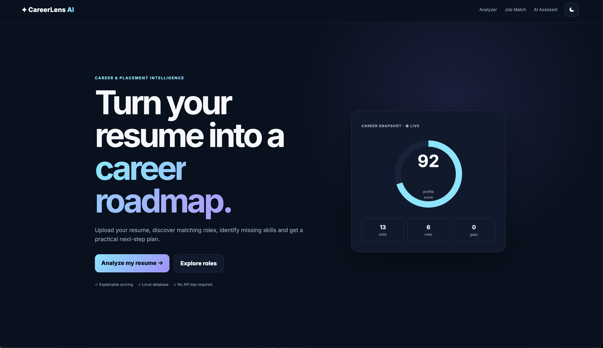
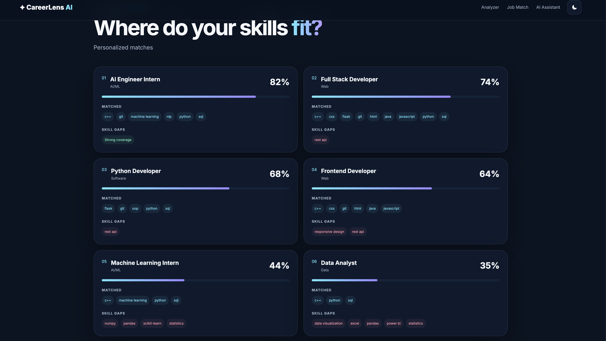

# CareerLens AI 🚀

> AI-powered Resume Analyzer & Career Guidance Platform built with Python, Flask and JavaScript.

CareerLens AI helps students and job seekers understand their resume, identify relevant skills, explore suitable career roles, and get personalized career guidance.

## ✨ Features

- 📄 Resume upload and analysis
- 📊 Resume profile scoring
- 🧠 Automatic skill detection
- 💼 Job-role matching
- 🎯 Skill-gap identification
- 🤖 AI-style career assistant
- 💬 Personalized career advice
- 🌙 Modern dark UI
- 📱 Responsive interface

## 🛠️ Tech Stack

### Backend
- Python
- Flask
- SQLite

### Frontend
- HTML5
- CSS3
- JavaScript

### Tools
- Git
- GitHub
- VS Code

## 📸 Screenshots

### Resume Analyzer
The application analyzes the uploaded resume and generates a profile score, detected skills and resume statistics.

### Job Intelligence
CareerLens AI compares the user's skills with different job roles and identifies matching skills and skill gaps.

### Career Assistant
Users can ask career-related questions and receive guidance based on their resume and skills.

## 📂 Project Structure

```text
CareerLens-AI/
│
├── app.py
├── career_engine.py
├── database.py
├── requirements.txt
├── README.md
├── .gitignore
│
├── static/
│   ├── css/
│   └── js/
│
├── templates/
│   └── index.html
│
└── uploads/
## 📸 Project Screenshots

### 🏠 Home Dashboard


### 💼 Job Match
